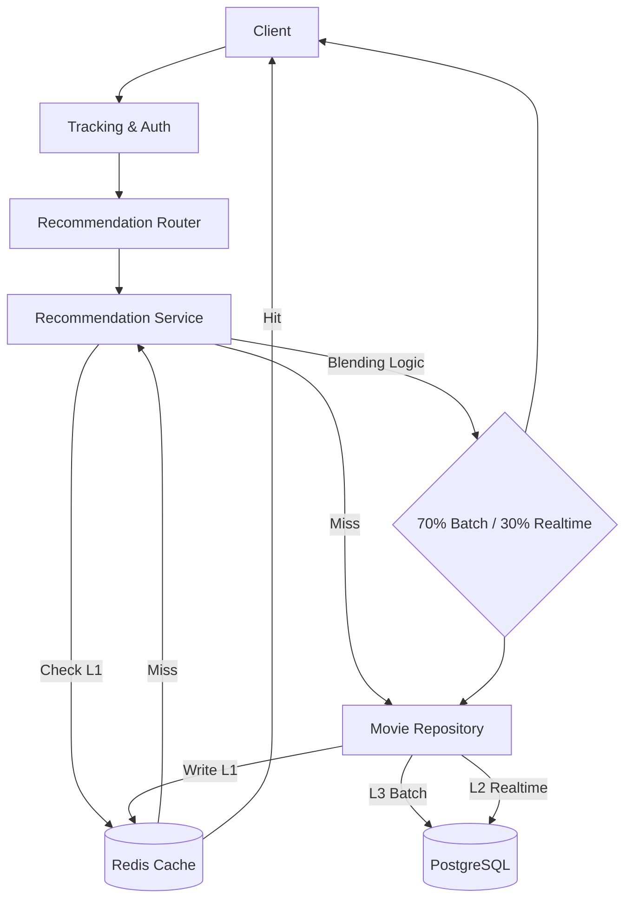

# Architecture Documentation

## 1. System Overview

The **Movie Recommendation System** applies a **Lambda Architecture** to combine the benefits of efficient batch processing with responsive real-time analysis.

-   **Batch Layer (Offline)**: Computes heavy Recommendation algorithms (Collaborative Filtering, Matrix Factorization) nightly/weekly. Results are stored in PostgreSQL (`batch_recommendations`).
-   **Speed Layer (Real-time)**: Uses Vector Embeddings (PGVector) to find similar movies based on immediate user interactions (Real-time Content-Based Filtering).
-   **Serving Layer (API)**: A FastAPI application that blends Batch and Speed layers to deliver the final list of recommendations.

## 2. Directory Structure

The FastAPI application follows a rigorous **Layered Architecture** to ensure separation of concerns and testability.

```
fastapi/
├── app/
│   ├── core/           # Core configurations and security (hashing, jwt)
│   ├── models/         # SQLAlchemy ORM Models (Database Layer)
│   ├── schemas/        # Pydantic Schemas (Data Transfer Objects)
│   ├── repositories/   # Data Access Layer (SQL/Redis wrapper)
│   ├── services/       # Business Logic Layer (Blending, Auth)
│   ├── routers/        # API Controllers (Auth, Recs, Events)
│   ├── dependencies.py # Dependency Injection (DI) Container
│   ├── main.py         # App Entrypoint & Middleware
│   ├── middleware.py   # Request Tracking & Custom Middleware
│   └── logging_config.py
├── tests/              # Pytest Suite (Unit & Integration)
└── docs/               # Documentation
```

## 3. Request Flow

The life of a request (e.g., `GET /api/recommendations`) flows through these layers:



## 4. Components

### **4.1 Middleware**
-   **RequestTrackingMiddleware**: Assigns a UUID `X-Request-ID` to every request for tracing. Logs duration and status codes.
-   **SlowAPI**: Implements Rate Limiting (Token Bucket) to prevent abuse.

### **4.2 Services**
-   **AuthService**: Handles User Registration and JWT Login. Uses `Argon2` for password hashing.
-   **RecommendationService**:
    -   **Hybrid Blending**: Combines Batch score (0.7 weight) with Realtime score (0.3 weight).
    -   **Fallback**: Returns "Popular Movies" if user has no data (Cold Start).
    -   **Caching**: Stores final blended list in Redis for 1 hour.

### **4.3 Repositories**
-   **MovieRepository**: Handles all "Read" operations for movies and recommendations.
-   **UserRepository**: Handles User CRUD.
-   **LogRepository**: Handles Logging events (Served Recs, Feedback) to DB.

## 5. Security
-   **Authentication**: OAuth2 Password Bearer flow.
-   **Authorization**: API Keys (for App clients) and JWT (for Users).
-   **Passwords**: Never stored in plain text. Hashed using Argon2.

## 6. Monitoring
-   **Prometheus**: Exposes application metrics at `/metrics`.
-   **Logging**: JSON-structured logs for easy ingestion by ELK/Splunk.
