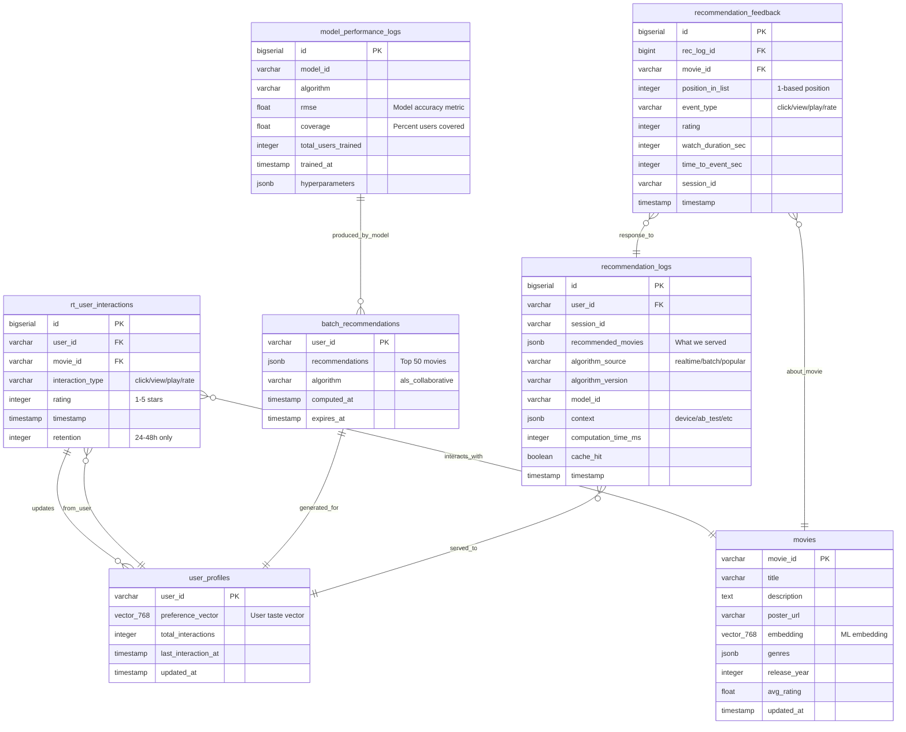

```mermaid
erDiagram
    %% =============================================
    %% CORE ENTITIES
    %% =============================================
    movies {
        varchar movie_id PK
        varchar title
        text description
        varchar poster_url
        vector_768 embedding "ML embedding"
        jsonb genres
        integer release_year
        float avg_rating
        timestamp updated_at
    }
    
    user_profiles {
        varchar user_id PK
        vector_768 preference_vector "User taste vector"
        integer total_interactions
        timestamp last_interaction_at
        timestamp updated_at
    }
    
    %% =============================================
    %% ONLINE LAYER TABLES (Hot data)
    %% =============================================
    rt_user_interactions {
        bigserial id PK
        varchar user_id FK
        varchar movie_id FK
        varchar interaction_type "click/view/play/rate"
        integer rating "1-5 stars"
        timestamp timestamp
        integer retention "24-48h only"
    }
    
    batch_recommendations {
        varchar user_id PK
        jsonb recommendations "Top 50 movies"
        varchar algorithm "als_collaborative"
        timestamp computed_at
        timestamp expires_at
    }
    
    %% =============================================
    %% OFFLINE LAYER TABLES (Analytics)
    %% =============================================
    recommendation_logs {
        bigserial id PK
        varchar user_id FK
        varchar session_id
        jsonb recommended_movies "What we served"
        varchar algorithm_source "realtime/batch/popular"
        varchar algorithm_version
        varchar model_id
        jsonb context "device/ab_test/etc"
        integer computation_time_ms
        boolean cache_hit
        timestamp timestamp
    }
    
    recommendation_feedback {
        bigserial id PK
        bigint rec_log_id FK
        varchar movie_id FK
        integer position_in_list "1-based position"
        varchar event_type "click/view/play/rate"
        integer rating
        integer watch_duration_sec
        integer time_to_event_sec
        varchar session_id
        timestamp timestamp
    }
    
    model_performance_logs {
        bigserial id PK
        varchar model_id
        varchar algorithm
        float rmse "Model accuracy metric"
        float coverage "Percent users covered"
        integer total_users_trained
        timestamp trained_at
        jsonb hyperparameters
    }
    
    %% =============================================
    %% RELATIONSHIPS
    %% =============================================
    
    %% Online Layer Relationships
    rt_user_interactions ||--o{ user_profiles : "updates"
    rt_user_interactions }o--|| movies : "interacts_with"
    rt_user_interactions }o--|| user_profiles : "from_user"
    
    batch_recommendations ||--|| user_profiles : "generated_for"
    
    %% Offline Layer Relationships
    recommendation_logs }o--|| user_profiles : "served_to"
    recommendation_feedback }o--|| recommendation_logs : "response_to"
    recommendation_feedback }o--|| movies : "about_movie"
    
    model_performance_logs ||--o{ batch_recommendations : "produced_by_model"
```
