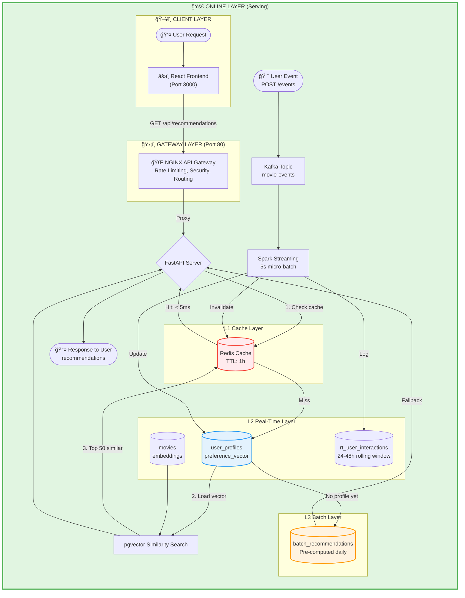

```mermaid
flowchart TB
    %% =============================================
    %% ONLINE LAYER - Real-Time Serving
    %% =============================================
    
    subgraph ONLINE["🚀 ONLINE LAYER (Serving)"]
        direction TB
        
        subgraph L1["L1 Cache Layer"]
            Redis[(Redis Cache<br/>TTL: 1h)]
        end
        
        subgraph L2["L2 Real-Time Layer"]
            UserProfile[(user_profiles<br/>preference_vector)]
            Movies[(movies<br/>embeddings)]
            RTInteractions[(rt_user_interactions<br/>24-48h rolling window)]
        end
        
        subgraph L3["L3 Batch Layer"]
            BatchRecs[(batch_recommendations<br/>Pre-computed daily)]
        end
        
        subgraph CLIENT["ğŸ–¥ï¸ CLIENT LAYER"]
            direction TB
            User([👤 User Request])
            React["âš›ï¸ React Frontend<br/>(Port 3000)"]
        end

        subgraph GATEWAY["ğŸ›¡ï¸ GATEWAY LAYER (Port 80)"]
            Nginx["🌠NGINX API Gateway<br/>Rate Limiting, Security, Routing"]
        end

        User --> React
        React -->|GET /api/recommendations| Nginx
        Nginx -->|Proxy| FastAPI{FastAPI Server}
        
        FastAPI -->|1. Check cache| Redis
        Redis -->|Hit: < 5ms| FastAPI
        Redis -->|Miss| UserProfile
        
        UserProfile -->|2. Load vector| VectorSearch[pgvector Similarity Search]
        Movies --> VectorSearch
        VectorSearch -->|3. Top 50 similar| Redis
        VectorSearch --> FastAPI
        
        UserProfile -->|No profile yet| BatchRecs
        BatchRecs -->|Fallback| FastAPI
        
        FastAPI --> Response([📤 Response to User<br/>recommendations])
        
        %% Real-time updates
        UserEvent([📨 User Event<br/>POST /events]) --> Kafka[Kafka Topic<br/>movie-events]
        Kafka --> SparkStream[Spark Streaming<br/>5s micro-batch]
        SparkStream -->|Update| UserProfile
        SparkStream -->|Log| RTInteractions
        SparkStream -->|Invalidate| Redis
    end
    
    style ONLINE fill:#e1f5e1,stroke:#4caf50,stroke-width:3px
    style Redis fill:#ffebee,stroke:#f44336,stroke-width:2px
    style UserProfile fill:#e3f2fd,stroke:#2196f3,stroke-width:2px
    style BatchRecs fill:#fff3e0,stroke:#ff9800,stroke-width:2px
```
