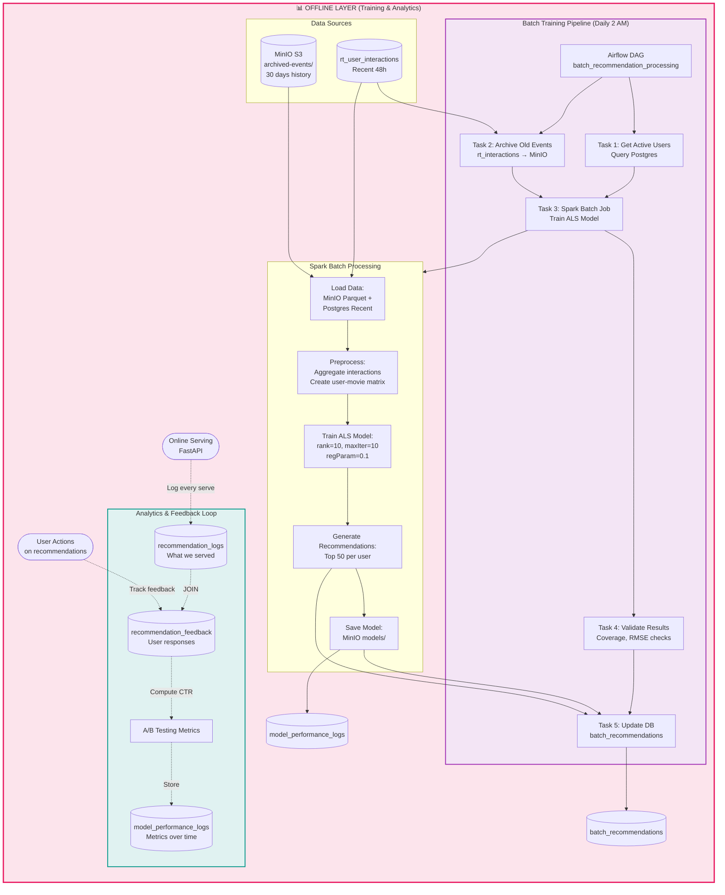

```mermaid
flowchart TB
    %% =============================================
    %% OFFLINE LAYER - Batch Processing
    %% =============================================
    
    subgraph OFFLINE["📊 OFFLINE LAYER (Training & Analytics)"]
        direction TB
        
        subgraph DataSources["Data Sources"]
            RTInteractions[(rt_user_interactions<br/>Recent 48h)]
            MinIO[(MinIO S3<br/>archived-events/<br/>30 days history)]
        end
        
        subgraph Training["Batch Training Pipeline (Daily 2 AM)"]
            direction TB
            
            AirflowDAG[Airflow DAG<br/>batch_recommendation_processing]
            
            Task1[Task 1: Get Active Users<br/>Query Postgres]
            Task2[Task 2: Archive Old Events<br/>rt_interactions → MinIO]
            Task3[Task 3: Spark Batch Job<br/>Train ALS Model]
            Task4[Task 4: Validate Results<br/>Coverage, RMSE checks]
            Task5[Task 5: Update DB<br/>batch_recommendations]
            
            AirflowDAG --> Task1
            AirflowDAG --> Task2
            Task1 --> Task3
            Task2 --> Task3
            Task3 --> Task4
            Task4 --> Task5
        end
        
        subgraph ModelTraining["Spark Batch Processing"]
            LoadData[Load Data:<br/>MinIO Parquet +<br/>Postgres Recent]
            PrepData[Preprocess:<br/>Aggregate interactions<br/>Create user-movie matrix]
            TrainALS[Train ALS Model:<br/>rank=10, maxIter=10<br/>regParam=0.1]
            GenerateRecs[Generate Recommendations:<br/>Top 50 per user]
            SaveModel[Save Model:<br/>MinIO models/]
            
            LoadData --> PrepData
            PrepData --> TrainALS
            TrainALS --> GenerateRecs
            GenerateRecs --> SaveModel
        end
        
        subgraph Analytics["Analytics & Feedback Loop"]
            RecLogs[(recommendation_logs<br/>What we served)]
            RecFeedback[(recommendation_feedback<br/>User responses)]
            ModelPerf[(model_performance_logs<br/>Metrics over time)]
            
            RecLogs -.->|JOIN| RecFeedback
            RecFeedback -.->|Compute CTR| Metrics[A/B Testing Metrics]
            Metrics -.->|Store| ModelPerf
        end
        
        %% Connections between sections
        RTInteractions --> Task2
        RTInteractions --> LoadData
        MinIO --> LoadData
        
        Task3 --> ModelTraining
        SaveModel --> Task5
        GenerateRecs --> Task5
        
        Task5 --> BatchRecsDB[(batch_recommendations)]
        SaveModel --> ModelPerfDB[(model_performance_logs)]
        
        %% Online serving logs analytics
        OnlineServing([Online Serving<br/>FastAPI]) -.->|Log every serve| RecLogs
        UserActions([User Actions<br/>on recommendations]) -.->|Track feedback| RecFeedback
    end
    
    style OFFLINE fill:#fce4ec,stroke:#e91e63,stroke-width:3px
    style Training fill:#f3e5f5,stroke:#9c27b0,stroke-width:2px
    style Analytics fill:#e0f2f1,stroke:#009688,stroke-width:2px
```
