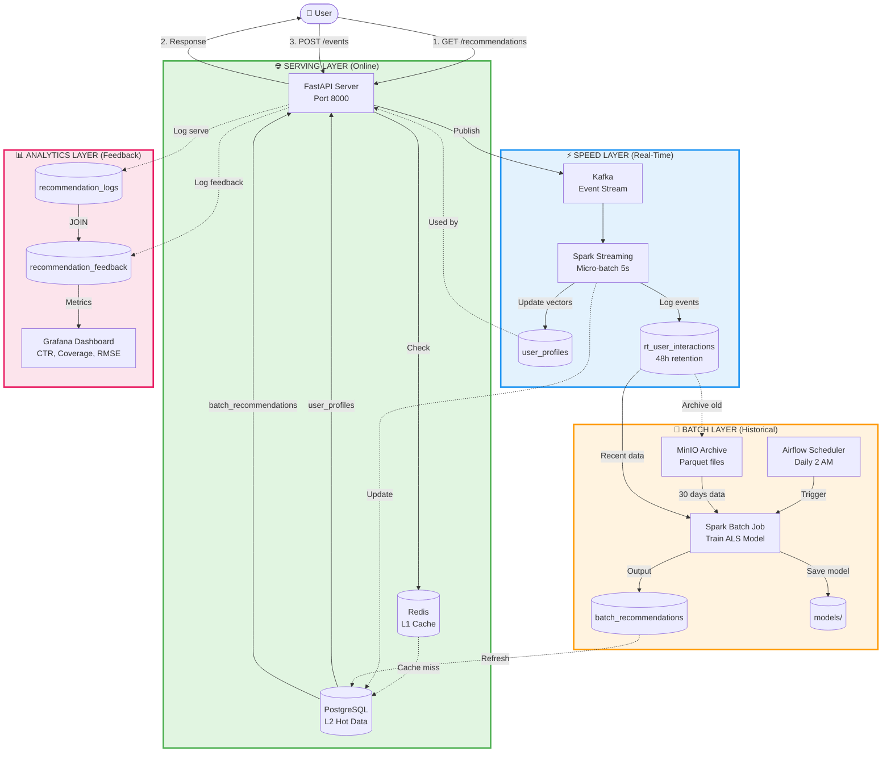

```mermaid
flowchart TB
    %% =============================================
    %% COMPLETE LAMBDA ARCHITECTURE
    %% =============================================
    
    User([👤 User])
    
    subgraph SERVING["🌐 SERVING LAYER (Online)"]
        direction LR
        FastAPI[FastAPI Server<br/>Port 8000]
        Redis[(Redis<br/>L1 Cache)]
        Postgres[(PostgreSQL<br/>L2 Hot Data)]
    end
    
    subgraph SPEED["⚡ SPEED LAYER (Real-Time)"]
        direction TB
        Kafka[Kafka<br/>Event Stream]
        SparkStream[Spark Streaming<br/>Micro-batch 5s]
        
        Kafka --> SparkStream
        SparkStream -->|Update vectors| UserProfiles[(user_profiles)]
        SparkStream -->|Log events| RTInteractions[(rt_user_interactions<br/>48h retention)]
    end
    
    subgraph BATCH["🔄 BATCH LAYER (Historical)"]
        direction TB
        Archive[MinIO Archive<br/>Parquet files]
        AirflowScheduler[Airflow Scheduler<br/>Daily 2 AM]
        SparkBatch[Spark Batch Job<br/>Train ALS Model]
        
        AirflowScheduler -->|Trigger| SparkBatch
        RTInteractions -.->|Archive old| Archive
        Archive -->|30 days data| SparkBatch
        RTInteractions -->|Recent data| SparkBatch
        SparkBatch -->|Output| BatchRecs[(batch_recommendations)]
        SparkBatch -->|Save model| Models[(models/)]
    end
    
    subgraph ANALYTICS["📊 ANALYTICS LAYER (Feedback)"]
        direction TB
        RecLogs[(recommendation_logs)]
        RecFeedback[(recommendation_feedback)]
        Dashboard[Grafana Dashboard<br/>CTR, Coverage, RMSE]
        
        RecLogs -->|JOIN| RecFeedback
        RecFeedback -->|Metrics| Dashboard
    end
    
    %% User interactions
    User -->|1. GET /recommendations| FastAPI
    FastAPI -->|Check| Redis
    Redis -.->|Cache miss| Postgres
    Postgres -->|user_profiles| FastAPI
    Postgres -->|batch_recommendations| FastAPI
    FastAPI -->|2. Response| User
    
    User -->|3. POST /events| FastAPI
    FastAPI -->|Publish| Kafka
    
    %% Logging
    FastAPI -.->|Log serve| RecLogs
    FastAPI -.->|Log feedback| RecFeedback
    
    %% Data flow between layers
    SparkStream -.->|Update| Postgres
    BatchRecs -.->|Refresh| Postgres
    UserProfiles -.->|Used by| FastAPI
    
    %% Styling
    style SERVING fill:#e1f5e1,stroke:#4caf50,stroke-width:3px
    style SPEED fill:#e3f2fd,stroke:#2196f3,stroke-width:3px
    style BATCH fill:#fff3e0,stroke:#ff9800,stroke-width:3px
    style ANALYTICS fill:#fce4ec,stroke:#e91e63,stroke-width:3px
```
