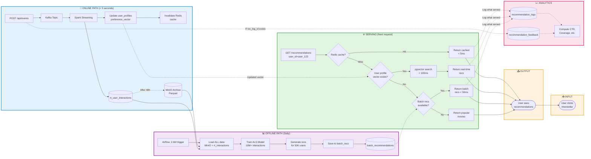

```mermaid
flowchart LR
    %% =============================================
    %% COMPLETE DATA LIFECYCLE
    %% =============================================
    
    subgraph Input["📥 INPUT"]
        UserClick([User clicks<br/>Interstellar])
    end
    
    subgraph Online["🚀 ONLINE PATH (< 5 seconds)"]
        direction TB
        E1[POST /api/events] --> Kafka1[Kafka Topic]
        Kafka1 --> Stream1[Spark Streaming]
        Stream1 --> Update1[Update user_profiles<br/>preference_vector]
        Update1 --> Cache1[Invalidate Redis<br/>cache]
        
        Stream1 --> Log1[(rt_user_interactions)]
        
        Log1 -.->|After 48h| Archive1[(MinIO Archive<br/>Parquet)]
    end
    
    subgraph Offline["📊 OFFLINE PATH (Daily)"]
        direction TB
        Schedule[Airflow: 2 AM trigger]
        
        Load[Load ALL data:<br/>MinIO + rt_interactions]
        Train[Train ALS Model<br/>10M+ interactions]
        Generate[Generate recs<br/>for 50K users]
        Save[Save to batch_recs]
        
        Schedule --> Load
        Archive1 --> Load
        Log1 --> Load
        Load --> Train
        Train --> Generate
        Generate --> Save
        Save --> BatchDB[(batch_recommendations)]
    end
    
    subgraph Serving["🌐 SERVING (Next request)"]
        direction TB
        Request[GET /recommendations<br/>user_id=user_123]
        
        TryL1{Redis cache?}
        TryL2{User profile<br/>vector exists?}
        TryL3{Batch recs<br/>available?}
        
        Request --> TryL1
        TryL1 -->|Hit| ReturnCache[Return cached<br/>< 5ms]
        TryL1 -->|Miss| TryL2
        
        Update1 -.->|Updated vector| TryL2
        
        TryL2 -->|Yes| Compute[pgvector search<br/>< 100ms]
        Compute --> ReturnRT[Return real-time<br/>recs]
        
        TryL2 -->|No| TryL3
        TryL3 -->|Yes| ReturnBatch[Return batch<br/>recs < 50ms]
        BatchDB -.-> TryL3
        TryL3 -->|No| ReturnPopular[Return popular<br/>movies]
    end
    
    subgraph Analytics["📈 ANALYTICS"]
        direction TB
        LogServe[(recommendation_logs)]
        LogFeedback[(recommendation_feedback)]
        
        ReturnCache -.->|Log what served| LogServe
        ReturnRT -.->|Log what served| LogServe
        ReturnBatch -.->|Log what served| LogServe
        
        E1 -.->|If rec_log_id exists| LogFeedback
        
        LogServe -.-> Metrics[Compute CTR,<br/>Coverage, etc.]
        LogFeedback -.-> Metrics
    end
    
    subgraph Output["📤 OUTPUT"]
        Response([User sees<br/>recommendations])
    end
    
    ReturnCache --> Response
    ReturnRT --> Response
    ReturnBatch --> Response
    ReturnPopular --> Response
    
    Response --> UserClick
    
    style Input fill:#fff3e0,stroke:#ff9800,stroke-width:2px
    style Online fill:#e3f2fd,stroke:#2196f3,stroke-width:3px
    style Offline fill:#f3e5f5,stroke:#9c27b0,stroke-width:3px
    style Serving fill:#e1f5e1,stroke:#4caf50,stroke-width:3px
    style Analytics fill:#fce4ec,stroke:#e91e63,stroke-width:3px
    style Output fill:#fff3e0,stroke:#ff9800,stroke-width:2px
```
