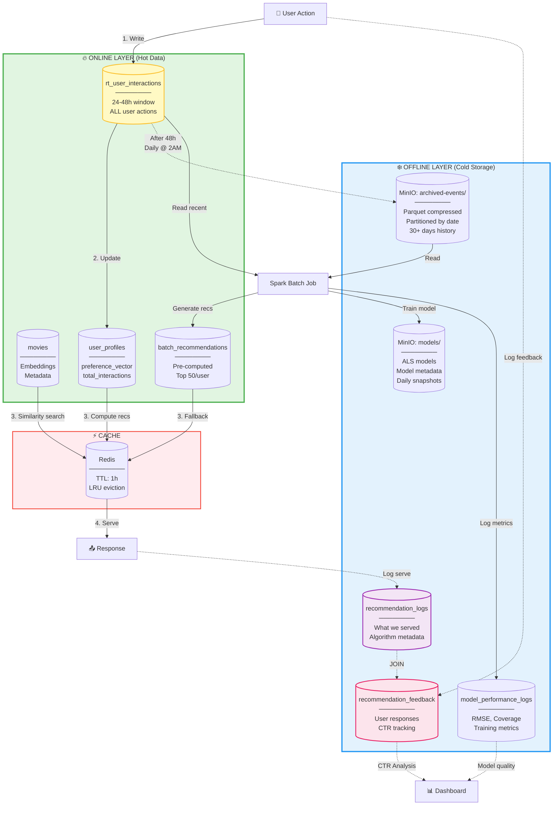

```mermaid
graph TB
    %% =============================================
    %% DETAILED TABLE INTERACTIONS
    %% =============================================
    
    subgraph OnlineHot["🔥 ONLINE LAYER (Hot Data)"]
        direction TB
        
        Movies[(movies<br/>────────<br/>Embeddings<br/>Metadata)]
        
        UserProfiles[(user_profiles<br/>────────<br/>preference_vector<br/>total_interactions)]
        
        RTInteractions[(rt_user_interactions<br/>────────<br/>24-48h window<br/>ALL user actions)]
        
        BatchRecs[(batch_recommendations<br/>────────<br/>Pre-computed<br/>Top 50/user)]
    end
    
    subgraph OnlineCache["⚡ CACHE"]
        Redis[(Redis<br/>────────<br/>TTL: 1h<br/>LRU eviction)]
    end
    
    subgraph OfflineCold["❄️ OFFLINE LAYER (Cold Storage)"]
        direction TB
        
        MinIOEvents[(MinIO: archived-events/<br/>────────<br/>Parquet compressed<br/>Partitioned by date<br/>30+ days history)]
        
        MinIOModels[(MinIO: models/<br/>────────<br/>ALS models<br/>Model metadata<br/>Daily snapshots)]
        
        RecLogs[(recommendation_logs<br/>────────<br/>What we served<br/>Algorithm metadata)]
        
        RecFeedback[(recommendation_feedback<br/>────────<br/>User responses<br/>CTR tracking)]
        
        ModelPerf[(model_performance_logs<br/>────────<br/>RMSE, Coverage<br/>Training metrics)]
    end
    
    %% Online Operations
    UserAction[👤 User Action] -->|1. Write| RTInteractions
    RTInteractions -->|2. Update| UserProfiles
    UserProfiles -->|3. Compute recs| Redis
    Movies -->|3. Similarity search| Redis
    BatchRecs -->|3. Fallback| Redis
    Redis -->|4. Serve| UserResponse[📤 Response]
    
    %% Logging
    UserResponse -.->|Log serve| RecLogs
    UserAction -.->|Log feedback| RecFeedback
    
    %% Archival
    RTInteractions -.->|After 48h<br/>Daily @ 2AM| MinIOEvents
    
    %% Batch Processing
    MinIOEvents -->|Read| SparkBatch[Spark Batch Job]
    RTInteractions -->|Read recent| SparkBatch
    SparkBatch -->|Train model| MinIOModels
    SparkBatch -->|Generate recs| BatchRecs
    SparkBatch -->|Log metrics| ModelPerf
    
    %% Analytics
    RecLogs -.->|JOIN| RecFeedback
    RecFeedback -.->|CTR Analysis| Dashboard[📊 Dashboard]
    ModelPerf -.->|Model quality| Dashboard
    
    %% Styling
    style OnlineHot fill:#e1f5e1,stroke:#4caf50,stroke-width:3px
    style OnlineCache fill:#ffebee,stroke:#f44336,stroke-width:2px
    style OfflineCold fill:#e3f2fd,stroke:#2196f3,stroke-width:3px
    
    style RTInteractions fill:#fff9c4,stroke:#fbc02d,stroke-width:2px
    style RecLogs fill:#f3e5f5,stroke:#9c27b0,stroke-width:2px
    style RecFeedback fill:#fce4ec,stroke:#e91e63,stroke-width:2px
```
