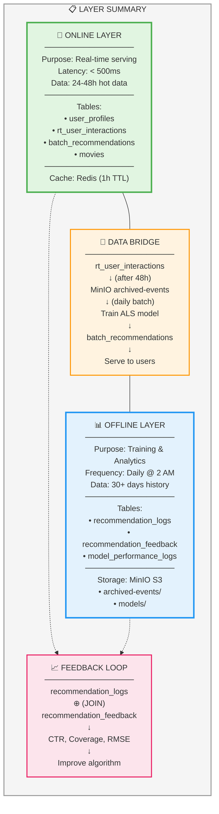

```mermaid
graph TD
    subgraph Summary["📋 LAYER SUMMARY"]
        direction TB
        
        Online["🚀 ONLINE LAYER<br/>────────────────<br/>Purpose: Real-time serving<br/>Latency: < 500ms<br/>Data: 24-48h hot data<br/>────────────────<br/>Tables:<br/>• user_profiles<br/>• rt_user_interactions<br/>• batch_recommendations<br/>• movies<br/>────────────────<br/>Cache: Redis (1h TTL)"]
        
        Offline["📊 OFFLINE LAYER<br/>────────────────<br/>Purpose: Training & Analytics<br/>Frequency: Daily @ 2 AM<br/>Data: 30+ days history<br/>────────────────<br/>Tables:<br/>• recommendation_logs<br/>• recommendation_feedback<br/>• model_performance_logs<br/>────────────────<br/>Storage: MinIO S3<br/>• archived-events/<br/>• models/"]
        
        Bridge["🔄 DATA BRIDGE<br/>────────────────<br/>rt_user_interactions<br/>↓ (after 48h)<br/>MinIO archived-events<br/>↓ (daily batch)<br/>Train ALS model<br/>↓<br/>batch_recommendations<br/>↓<br/>Serve to users"]
        
        Analytics["📈 FEEDBACK LOOP<br/>────────────────<br/>recommendation_logs<br/>⊕ (JOIN)<br/>recommendation_feedback<br/>↓<br/>CTR, Coverage, RMSE<br/>↓<br/>Improve algorithm"]
        
        Online --- Bridge
        Bridge --- Offline
        Online -.-> Analytics
        Offline -.-> Analytics
    end
    
    style Summary fill:#f5f5f5,stroke:#9e9e9e,stroke-width:2px
    style Online fill:#e1f5e1,stroke:#4caf50,stroke-width:3px
    style Offline fill:#e3f2fd,stroke:#2196f3,stroke-width:3px
    style Bridge fill:#fff3e0,stroke:#ff9800,stroke-width:2px
    style Analytics fill:#fce4ec,stroke:#e91e63,stroke-width:2px
```
