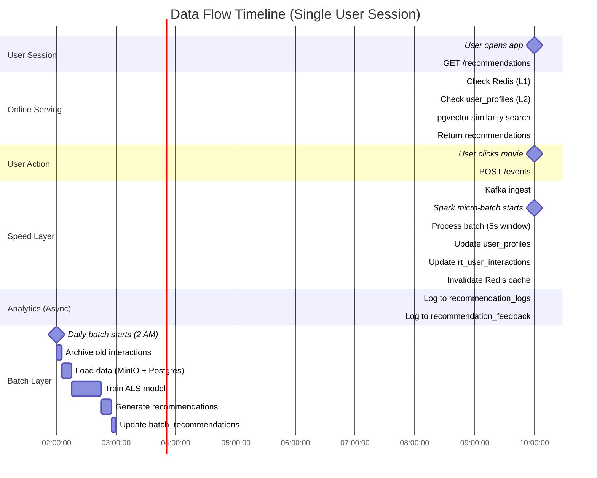

```mermaid
gantt
    title Data Flow Timeline (Single User Session)
    dateFormat  HH:mm:ss
    axisFormat  %H:%M:%S
    
    section User Session
    User opens app                    :milestone, m1, 10:00:00, 0s
    GET /recommendations              :active, req1, 10:00:00, 5s
    
    section Online Serving
    Check Redis (L1)                  :crit, l1, 10:00:00, 3ms
    Check user_profiles (L2)          :l2, after l1, 50ms
    pgvector similarity search        :l2s, after l2, 40ms
    Return recommendations            :done, ret1, after l2s, 2ms
    
    section User Action
    User clicks movie                 :milestone, m2, 10:00:05, 0s
    POST /events                      :active, evt1, 10:00:05, 3s
    
    section Speed Layer
    Kafka ingest                      :kafka1, 10:00:05, 50ms
    Spark micro-batch starts          :milestone, m3, 10:00:10, 0s
    Process batch (5s window)         :stream1, 10:00:10, 100ms
    Update user_profiles              :update1, after stream1, 10ms
    Update rt_user_interactions       :log1, after stream1, 5ms
    Invalidate Redis cache            :inv1, after update1, 2ms
    
    section Analytics (Async)
    Log to recommendation_logs        :analytics1, 10:00:05, 5ms
    Log to recommendation_feedback    :analytics2, after analytics1, 3ms
    
    section Batch Layer
    Daily batch starts (2 AM)         :milestone, m4, 02:00:00, 0s
    Archive old interactions          :archive, 02:00:00, 5m
    Load data (MinIO + Postgres)      :load, after archive, 10m
    Train ALS model                   :train, after load, 30m
    Generate recommendations          :generate, after train, 10m
    Update batch_recommendations      :savebatch, after generate, 5m
```
